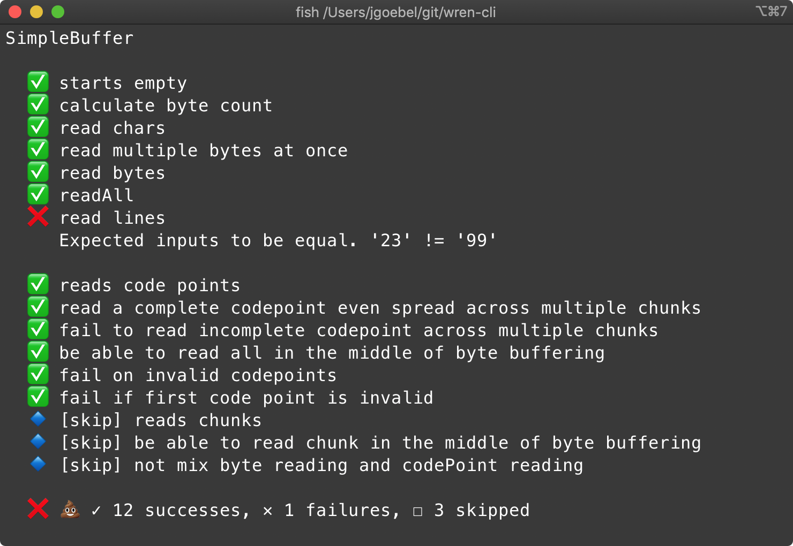

[](https://forthebadge.com)
[](https://forthebadge.com)

#  wren-testie


Simple and beautiful testing framework for [Wren Console](https://github.com/joshgoebel/wren-console).



### Features

- bring whatever assertion library you'd like to use with you
- it's easy to define custom reporters
- less than 100 lines of Wren if you want to learn how it works


### Tests your way

#### Shoulda

```js
Testie.test("Calculator") { |it|
  it.context("basic math") {
    it.should("add") {  }
    it.should("subtract") {  }
  }
}
```

#### Specs

```js
Testie.test("Calculator") { |it|
  it.describe("basic math") {
    it.must("add") {  }
    it.must("subtract") {  }
    it.skip("multiply") {  }
  }
}
```

#### Simple

```js
Testie.test("Calculator") { |it, skip|
  it.describe("basic math") {
    it.test("add") {  }
    it.test("subtract") {  }
    skip.test("multiply") {  }
  }
}
```

I'm open to more styles if they can be accomplished with simple aliases.  Open an issue.

### Example

```js
import "wren-testie/testie" for Testie
import "wren-assert/Assert" for Assert

// defining custom reporters is super simple
class DotReporter {
    // ..
    skip(name) { System.write("S") }
    fail(name, error) { System.write("X") }
    success(name) { System.write(".") }
    // ..
}

var suite = Testie.new("Calculator") { |it, skip|

    it.should("add") {
        var calc = Calculator.new()
        Assert.equal(4, calc.add(2,2))
    }
    it.should("subtract") {
        var calc = Calculator.new()
        Assert.equal(4, calc.subtract(9,5))
    }
    skip.should("do Calculus") {
        // TODO: implement
    }

}
suite.reporter = DotReporter
suite.run()
```

#### Using the options map on the static `test` method:

```js
import "wren-testie/testie" for Testie
import "wren-testie/reporters/tap" for TapReporter

Testie.test("Features Under Test", {"reporter": TapReporter}) { |do, skip|
    do.test("Test Feature 1") {
        Expect.value(5.pow(3)).toEqual(125);
    }

    do.test("Test Feature 2") {
        Expect.value(1 == 2).toBe(true)
    }

    skip.test("Do not test me") {
        Expect.that {
            return "not yet implemented"
        }.toNotAbort
    }
}
```
Which might produce output like
```none
TAP version 13
1..3
ok 1 Test Feature 1
not ok 2 Test Feature 2
# expect(received).toEqual(expected)
#
# Expected: true
# Received: false
#
#   12 |
#   13 |     do.test("Test Feature 2") {
# > 14 |         Expect.value(1 == 2).toBe(true)
#   15 |     }
#   16 |
#
# at test(_,_) block argument (./example.spec.wren line 14)#
# ...
ok 3 Do not test me # SKIP
```

### Why not support wren-cli?

See my notes from the wren-console project itself:

> Provide the best learning environment for the forthcoming Exercism Wren track. For starters this means providing full introspection of stack traces when a Fiber aborts - allowing test suites to show helpful debugging information, including source code snippets. (thanks to @mhermier)

A test framework without proper backtraces and code excerpts is severely crippled IMHO, so this library will remain Wren Console only until such features are properly added to wren-cli proper.

### Contributions

Licensed MIT and open to contributions!

Please open an issue to discuss or find me on [Wren Discord](https://discord.gg/VTzuWmBavH).
